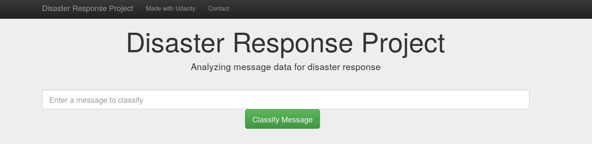

# Disaster Response Pipeline Project




## Table of Contents
1. [Description](#description)
2. [Getting Started](#getting_started)
	1. [Dependencies](#dependencies)
	2. [Installation](#installation)


<a name="descripton"></a>
## Description

The project aim is to build a Natural Language Processing (NLP) model to categorize messages on a real time basis. The dataset contains pre-labelled tweet and messages from real-life disaster events.

This project is divided in the following key sections:

1. Processing data, building an ETL pipeline to extract data from source, clean the data and save them in a SQLite DB
2. Build a machine learning pipeline to train a model that can classify text message in various categories
3. Run a web app which can show model results in real time

<a name="getting_started"></a>
## Getting Started

<a name="dependencies"></a>
### Dependencies
* Python 3.6+
* Machine Learning Libraries: NumPy, SciPy, Pandas, Sciki-Learn
* Natural Language Process Libraries: NLTK
* SQLlite Database Libraqries: SQLalchemy
* Web App and Data Visualization: Flask, Plotly

<a name="installation"></a>
### Installation
1. Clone the git repository:

```git clone https://github.com/eljandoubi/DisasterResponsePipeline.git```

2. Change directory

```cd DisasterResponsePipeline```

3. Create conda environment

```conda create -n "DisasterResponsePipeline" python=3.6```

4. Install dependencies

```pip install -r requirements.txt```

5. You can run the following commands in the project's directory to set up the database, train model and save the model.

    - To run ETL pipeline to clean data and store the processed data in the database
    
        ```python data/process_data.py data/disaster_messages.csv data/disaster_categories.csv data/disaster_response_db.db```
        
        
    - To run the ML pipeline that loads data from DB, trains classifier and saves the classifier as a pickle file
    
        ```python models/train_classifier.py data/disaster_response_db.db models/classifier.pkl```


6. Run the following command in the app's directory to run your web app.
    `python app/run.py`